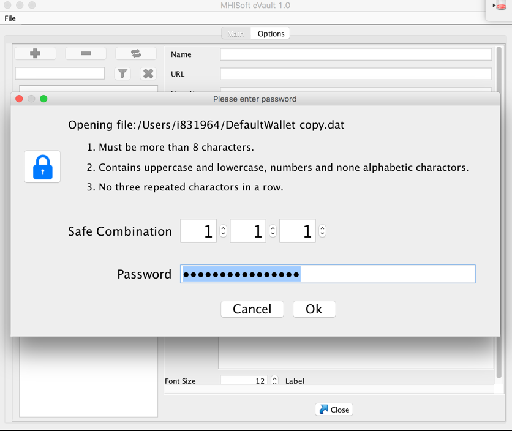
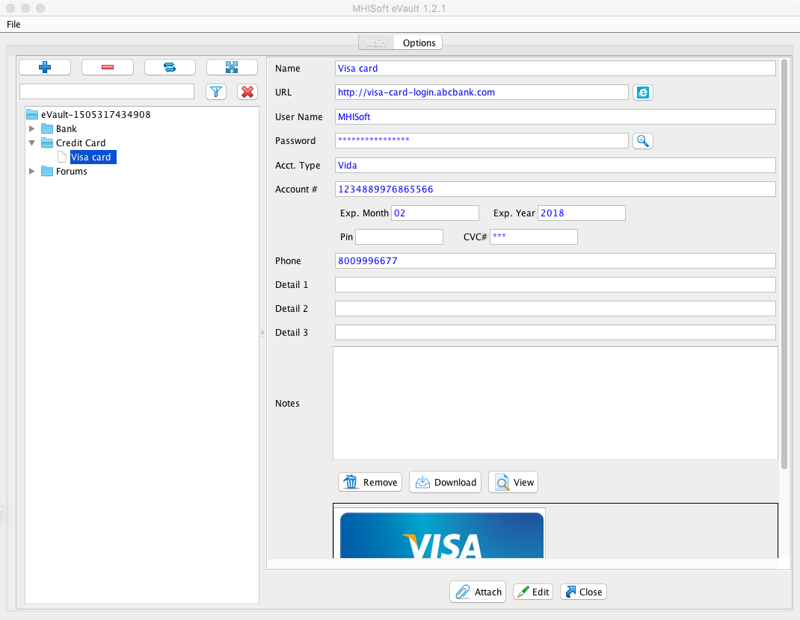

MHISoft eVault 
======================================================
MHISoft eVault is a open source password manager and password vault, i.e a secured eVault. 

It is suitable to store password , private document and any personal information. Since v1.2 it starts to support saving the attachment documents such images, PDF, Word Doc..etc to the eVault.  All the data are stored in a encrypted offline database with AES 256-bit key encryption.

One master password and a set of combination code is required to open the eVault. The master password  and combination code are stored as one-way-Hash and can't be reverse engineered. They are used to decrypt the database. 

I just don't trust any online or third party vault for storing my personal information and passwords.  So I created this open source. I believe a password manager vault should never be clound-based. So the MHISoft eVault does not use network at all by design. You can rest asure that not a single bit of data is transmitted over the network. You are in total control.  

Though the MHISoft eVault encrypted database is local, you can choose to share it on Google Drive or Dropbox.. etc. So you can share the same database across multiple devices. If somebody gets a hand on the encrypted data vault file, they won't be able to decrypt. 

The password once lost can't be recovered, which is by design. Even the author of this code can't recover the lost password. And without the password and combination, the vault can't be opened, so please keep the master password and combination key in a safe place, such as in your head only. 

Download
========
from the Releases tab above : https://github.com/mhisoft/eVault/releases

Features
=========
* Open source and Free. 
* Secure and fast.  AES 256-bit key encryption.
* Runs offline and database is kept local on your machine.
* Platform: Windows and Mac OS X...etc where Java is supported. 
* Organize passwords with categories.  
* Search the entire wallet and locate an item instantly. 
* Support multiple eVault data files. 
* Backup .
* Import and merge in changes from another data file. 
* Export an entry so you can transfer it to someone else. 
* Auto close the vault if idling for too long.
* Support adding images and attachment docs (PDF, DOC..etc). You can view or download them from the vault. 

Some technical details
======================

*  The JRE is bundled with the release. But if you use your own JRE or JDK , the  “Java Cryptography Extension (JCE) Unlimited Strength Jurisdiction Policy”  need to be installed. 

* All the data are stored locally, encrypted. By default, it uses the PBEWithHmacSHA512AndAES_256 algorithm, 256 bit key encryption provide by the Java 8.  No extra third party library is used. 
 
* Password is stored in the most secured Hash format. In theory the password can't be reverse engineered from this hash , not under the current human technology. Random salted hashing with the  PBKDF2WithHmacSHA512 algorithm is used.   More tech details please see  https://crackstation.net/hashing-security.htm for more information. (thanks to crackstation)

* The app runs offline by design so rest ensure there is absolutely no network connection used by the app. 
 While using other similar product which connects to the network, I have always been worried about the data could be secretly transmitted to somewhere across the network without my knowledge, either intentionally or unintentionally due to malware or virus.   The author decided to design the eVault by not using any kind of network activities (i.e. no port is opended on local and not remote port is reached from eVault either). The encrypted database is local unless you share it across the network.
 
 ## WIKI

 Check out the WIKI for additional information:
 https://github.com/mhisoft/eVault/wiki
 
 
 ## How to build from the source code
The parent or shell project is here : [evault-project](https://github.com/mhisoft/evault-app)

https://github.com/mhisoft/eVault/wiki/How-to-build-from-the-source-code
 
 
 ## License
Apache License 2.0, January 2004 http://www.apache.org/licenses/

(The text of this page is available for modification and reuse under the terms of the Creative Commons Attribution-Sharealike 3.0 Unported License and the GNU Free Documentation License (unversioned, with no invariant sections, front-cover texts, or back-cover texts).

## Disclaimer
The author is not responsible for loss of any kind incurred directly or indirectly by using this application.

## Donate if you feel like

Help to improve the app.
Any amount :)

